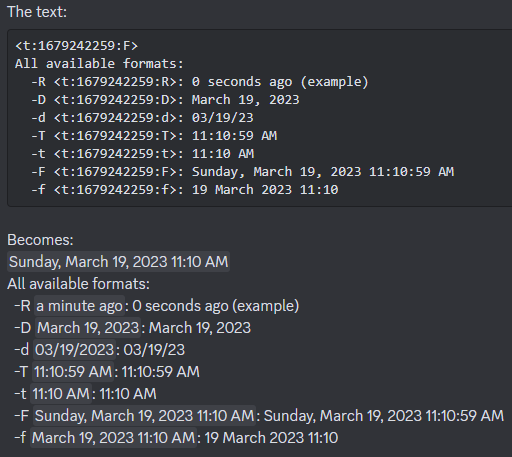

# Discord Timestamp Generator
Discord allows users to generate timestamps within their messages with `<t:UTC-Time:Format>`. These timestamps are displayed according to the reader's timezone, allowing for the timestamps to help coordinate people across time zones.

This script allows for you to quickly and easily generate a time stamp.

Sample output (in Discord):



## Usage
<!---
Commands to generate all example timestamps at the same time:
discord_timestamp "on January 1st, 2023" @12:30pm
discord_timestamp "on January 1st, 2023" @12:30pm -R
discord_timestamp "on January 1st, 2023" @12:30pm +1w3d62s
discord_timestamp "on January 1st, 2023" @12:30pm -3h16m
discord_timestamp "on January 1st, 2023" @12:30pm @2:30pm
discord_timestamp "on January 1st, 2023" @12:30pm @2pm
discord_timestamp "on January 1st, 2023" @12:30pm on:15/3/2023
discord_timestamp "on January 1st, 2023" @12:30pm -R on:31/12/2024 @8:45pm
--->
For demonstration purposes, assume all examples were generated on January 1st, 2023 at 12:30pm in the afternoon.
### Default
By default, the script uses the current date and time to generate the time stamp. Calling `discord_timestamp` will produce:
```
<t:1679247000:F>
All available formats:
  -R <t:1679247000:R>: 0 seconds ago (example)
  -D <t:1679247000:D>: March 19, 2023
  -d <t:1679247000:d>: 03/19/23
  -T <t:1679247000:T>: 12:30:00 PM
  -t <t:1679247000:t>: 12:30 PM
  -F <t:1679247000:F>: Sunday, March 19, 2023 12:30:00 PM
  -f <t:1679247000:f>: 19 March 2023 12:30
```

### Format Codes
Specifying a format code only changes the timestamp generated at the very top and which is copied to your clipboard. `discord_timestamp -R` will produce:
```
<t:1679247000:R>
All available formats:
  -R <t:1679247000:R>: 0 seconds ago (example)
  -D <t:1679247000:D>: March 19, 2023
  -d <t:1679247000:d>: 03/19/23
  -T <t:1679247000:T>: 12:30:00 PM
  -t <t:1679247000:t>: 12:30 PM
  -F <t:1679247000:F>: Sunday, March 19, 2023 12:30:00 PM
  -f <t:1679247000:f>: 19 March 2023 12:30
```

### Adjusting Time and Date
The time and date can be adjusted relative to the current time and date with the `+/-` argument. Valid adjustment formats are:
- `<seconds>s`
- `<minutes>m`
- `<hours>h`
- `<days>d`
- `<weeks>w`
Note: The order does not matter, e.g. `+5h23m6w` and `+6w5h23m` are identical.
To add 1 week, 3 days, and 62 seconds to the current time, use `+1w3d62s`. `discord_timestamp +1w3d62s` will produce:
```
<t:1680111062:F>
All available formats:
  -R <t:1680111062:R>: 0 seconds ago (example)
  -D <t:1680111062:D>: March 29, 2023
  -d <t:1680111062:d>: 03/29/23
  -T <t:1680111062:T>: 12:31:02 PM
  -t <t:1680111062:t>: 12:31 PM
  -F <t:1680111062:F>: Wednesday, March 29, 2023 12:31:02 PM
  -f <t:1680111062:f>: 29 March 2023 12:31
```

To subtract 3 hours and 16 minutes from the current time, use `-3h16m`. `discord_timestamp -3h16m` will produce:
```
<t:1679235240:F>
All available formats:
  -R <t:1679235240:R>: 0 seconds ago (example)
  -D <t:1679235240:D>: March 19, 2023
  -d <t:1679235240:d>: 03/19/23
  -T <t:1679235240:T>: 9:14:00 AM
  -t <t:1679235240:t>: 9:14 AM
  -F <t:1679235240:F>: Sunday, March 19, 2023 9:14:00 AM
  -f <t:1679235240:f>: 19 March 2023 9:14
```

### Specifying the Time
To change the time, use the `@` argument. Valid formats are:
- `@<hour>:<minutes><am/pm>`, e.g. `@2:30pm`
- `@<hour>:<am/pm>`, e.g. `@2pm`
- `@<hour>h:<minutes><m>`, e.g. `@14h:30m`
- `@<hour>h`, e.g. `@14h`
The first two formats are intended for using with a 12-hour clock cycle and the latter two are for users who prefer a 24-hour clock cycle.

`discord_timestamp @2:30pm` and `discord_timestamp @14h30m` will both produce:
```
<t:1679254200:F>
All available formats:
  -R <t:1679254200:R>: 0 seconds ago (example)
  -D <t:1679254200:D>: March 19, 2023
  -d <t:1679254200:d>: 03/19/23
  -T <t:1679254200:T>: 2:30:00 PM
  -t <t:1679254200:t>: 2:30 PM
  -F <t:1679254200:F>: Sunday, March 19, 2023 2:30:00 PM
  -f <t:1679254200:f>: 19 March 2023 2:30
```

`discord_timestamp @2pm` and `discord_timestamp @14h` will both produce:
```
<t:1679252400:F>
All available formats:
  -R <t:1679252400:R>: 0 seconds ago (example)
  -D <t:1679252400:D>: March 19, 2023
  -d <t:1679252400:d>: 03/19/23
  -T <t:1679252400:T>: 2:00:00 PM
  -t <t:1679252400:t>: 2:00 PM
  -F <t:1679252400:F>: Sunday, March 19, 2023 2:00:00 PM
  -f <t:1679252400:f>: 19 March 2023 2:00
```

### Specifying the Date
To change the date, use the `on` argument. Valid formats are:
- `"on <Month> <day>, <year>"`. <Month> can be full or abbreviated (e.g. March or Mar), and year can be full or abbreviated (e.g. 2023 or 23).
- `"on <Month> <day>th, <year>"`
- `"on <Month> <day> <year>"`
- `"on <Month> <day>th <year>"`
- `"on <Month> <day>"`
- `"on <Month> <day>th"`
- `on:<day>/<month>/<year>`. <month> is a number (e.g. 3).
- `on:<day>/<month>`. <month> is a number (e.g. 3).

`discord_timestamp "on March 15th"` and `discord_timestamp on:15/3/2023` will both (along with several other variations of the format) produce:
```
<t:1678901400:F>
All available formats:
  -R <t:1678901400:R>: 0 seconds ago (example)
  -D <t:1678901400:D>: March 15, 2023
  -d <t:1678901400:d>: 03/15/23
  -T <t:1678901400:T>: 12:30:00 PM
  -t <t:1678901400:t>: 12:30 PM
  -F <t:1678901400:F>: Wednesday, March 15, 2023 12:30:00 PM
  -f <t:1678901400:f>: 15 March 2023 12:30
```

### Combining Arguments
All of the previous arguments may be combined in any way. For example, if you want to specify a New Years Eve party for 2024 at 8:45pm (and have the countdown to it automatically copied to your clipboard), you can use `discord_timestamp -R on:31/12/2024 @8:45pm` to produce:
```
<t:1735699500:R>
All available formats:
  -R <t:1735699500:R>: 0 seconds ago (example)
  -D <t:1735699500:D>: December 31, 2024
  -d <t:1735699500:d>: 12/31/24
  -T <t:1735699500:T>: 8:45:00 PM
  -t <t:1735699500:t>: 8:45 PM
  -F <t:1735699500:F>: Tuesday, December 31, 2024 8:45:00 PM
  -f <t:1735699500:f>: 31 December 2024 8:45
```

## Format Codes
Discord has 7 distinct format codes:
- R - Relative Time: `0 seconds ago`
- D - Long Date: `March 19, 2023`
- d - Short Date: `03/19/23`
- T - Long Time: `12:30:00 PM`
- t - Short Time: `12:30 PM`
- F - Long Time and Date: `Sunday, March 19, 2023 12:30:00 PM`
- f - Short Time and Date: `19 March 2023 12:30`
Although timestamps with all format codes and their Discord representation are printed, only the timestamp with the specified format will be copied to the clipboard. Any of these codes may be passed in as `-<code>`, e.g. `discord_timestamp -R`, will copy the Relative timestamp to you clipboard. The default is `-F`.

## Dependencies
No dependancies other than Python 3.8 or above. However, if you have `pyperclip` installed (using `python3 -m pip install pyperclip`), the timestamp will automatically be copied to your clipboard.
